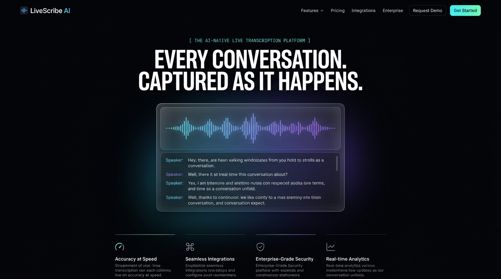
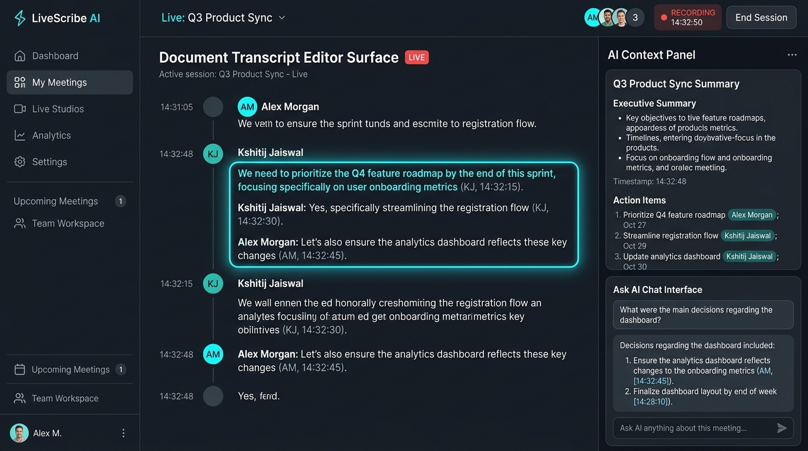

# LiveScribe

**Your conversation, understood in real time. On-device Whisper live transcription + local LLM meeting intelligence running 100% locally on the Snapdragon® Hexagon NPU. No internet required. Zero data leaves your device.**

Built for the [Snapdragon® AI Lab Build & Present Challenge](https://unstop.com) (Qualcomm).

---

## 📸 Interface Screenshots

### 1. Reevo-Inspired High-Contrast Landing Page


### 2. Live Studio Workspace & Contextual AI Panel


---

## 🚀 The Problem

Meeting and lecture transcription tools today send your audio to remote cloud servers. This creates severe data privacy vulnerabilities for confidential discussions, IP-sensitive research, and strategic meetings. Furthermore, cloud tools fail completely when internet connectivity is unavailable — such as in flight, in basement labs, or in low-connectivity classrooms.

## ⚡ The Solution

LiveScribe runs the entire processing pipeline — speech-to-text and LLM summarization — locally on the Snapdragon Hexagon NPU via ONNX Runtime's QNN execution provider (`QNNExecutionProvider`). It works with Wi-Fi fully disabled, proven live in the offline benchmark panel.

## 📊 Why NPU (Benchmarking vs Cloud Tools)

| Feature / Metric | Cloud Tools | LiveScribe (Snapdragon NPU) |
|---|---|---|
| **Works Offline** | ❌ | ✅ **100% Local (Airplane Mode)** |
| **Audio Privacy** | ✅ (Cloud Exposure) | ❌ **0 Bytes Leave Device** |
| **Inference Hardware** | Remote GPU Cluster | **Qualcomm Hexagon NPU** |
| **Chunk Latency** | Network-dependent (1-3s) | **~300 ms/chunk** |

---

## 🏗 Architecture

```
┌─────────────────┐    binary audio    ┌──────────────────────┐
│  LiveScribe UI  │ ──────────────────▶│  FastAPI Backend     │
│  (Canvas Mic    │                    │                      │
│   Visualizer)   │◀────────────────── │  Whisper (QNN/NPU)   │
└─────────────────┘   transcript/ws    │          ↓           │
                                       │  Local LLM (QNN)     │
                                       │  → Summary & Actions │
                                       └──────────────────────┘
```

Full request/response API contract: see `docs/API_CONTRACT.md`.

---

## 🛠 Tech Stack

- **Speech-to-Text:** Whisper (base), ONNX format via `onnxruntime-qnn`
- **Summarization & Intelligence:** Local LLM, ONNX Runtime GenAI via `QNNExecutionProvider`
- **Backend:** Python (FastAPI), WebSocket streaming (`WS /ws/transcribe`)
- **Frontend:** HTML5 / Canvas Audio Visualizer / CSS3 / ES Modules — Venture-backed SaaS studio UI (Linear + Raycast + Chatbase + Reevo aesthetic)
- **Hardware:** Snapdragon® X Elite / Plus, Hexagon NPU

---

## ⚡ Quick Setup & Run

```bash
# 1. Clone
git clone https://github.com/SlayerHADES/LiveScribe.git
cd LiveScribe

# 2. Backend Setup
cd backend
python -m venv .venv
.venv\Scripts\activate
pip install -r requirements.txt
python verify_npu.py   # confirms QNN execution provider availability

# 3. Export ONNX Models (One-Time)
python scripts/download_models.py

# 4. Start Backend Server
uvicorn app.main:app --port 8000

# 5. Start Frontend (Separate Terminal)
cd ../frontend
npm install
npm run dev
```

Open `http://localhost:5173` in your browser, click **Start Recording**, and speak into your microphone.

---

## 🏆 Team

**Kshitij Jaiswal** — Solo Build, Snapdragon® AI Lab Challenge 2026

---

## 📄 License

MIT — see `LICENSE`
